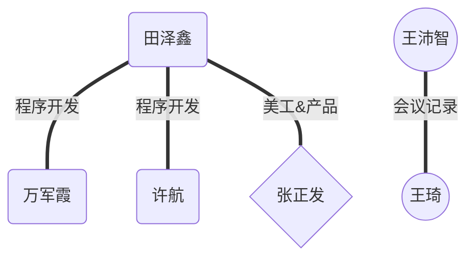

# 管理计划

[toc]

# 1.简介

## 1.1 项目概述

​	本项目为软件工程课程中的课设项目计科17.3第四组——博物馆导览子系统，在完成编码的同时旨在让同学们获得编程能力的提高。发布的产品是安卓的app、源代码、技术文档和用户手册等。主要工作是需求分析、系 统设计、开发测试，关键里程碑分别为需求规格说明书的发布，系统设计说明书的发布，和系统的交付。项目所需资源为版本控制服务器和个人开发工具，进度大约为6周，预算人工成本为 80 人天。

## 1.2 目标产品

安卓端安装程序（apk文件）、系统源代码、用户使用手册、技术文档包（包括需求规格说明书、系统 设计说明书、系统测试说明书、项目总结文档等）、项目进度日志包（至少每周一份）。

## 1.3 参考资料

《软件工程——理论、方法与实践》，孙家广 刘强， 高等教育出版社

《人月神话》，布鲁克斯，清华大写出版社

## 1.4 术语与缩写

Android studio：开发工具

sdk：软件开发工具包

api：应用程序接口

# 2.项目组织

## 2.1 组织结构

## 2.2 职务职责

| 角色             | 职责描述                                                  | 负责人员 |
| ---------------- | --------------------------------------------------------- | -------- |
| 项目组长         | 项目经理 领导项目团队，执行和管理项目，负责项目的交付工作 | 田泽鑫   |
| 组件开发程序员   | 将ui工程师的设计图进行代码实现                            | 许航     |
| 接口开发程序员   | 完成对接口的网络请求和本地数据存储等工作                  | 万军霞   |
| ui工程师         | 根据需求文档做出设计图                                    | 王琦     |
| 产品策划经理     | 将需求转化为需求文档并撰写更新需求文档                    | 王沛智   |
| 文档整理及测试员 | 撰写各类文档，进行软件测试                                | 张正发   |

# 3.管理过程

## 3.1 优先级划分

#### 基本管理原则： 

每位成员既是积极的建言者，又是负责的合作者。 决策应在充分的讨论基础上做出，并被及时有效的执行。 

#### 目标1

 按时按量完成项目的基本功能，按时发布产品 优先级：1（最高） 

#### 目标2

遵循规范化的项目运作标准，文档严谨完整，代码注释充分，便于后续维护 优先级：2 

#### 目标3

 产品运行稳定，界面友好易上手，可玩性强 优先级：3 

#### 目标4

注重团队建设，成员分工合理，合作默契，气氛融洽 优先级：4 

#### 目标5

 项目设计和开发上有创新，营造出卖点 优先级：5 

## 3.2 风险管理

#### 风险的详细描述

##### 风险1

开发技术不熟练 没有组员有曾使用过Android studio、Photoshop架构或开发app的经验，部分组员未使用过 git工具和 java编程语言。可能导致开发进度受阻，代码交流困难。 

##### 风险 2

项目缠身，疲于应对 组员需要上大量选修课及准备考研，另在多个课程有课设，可能出现应对不暇、无法正常推推进项目的情况。 

##### 风险4

需求变更频繁 在设计开发过程中可能发现原有需求不容易转化为设计稿，在测试体验过程中可能发现app并不好用，这都会带来需求的重新变更。

## 3.3 人员计划

A类 程序开发 根据提供api及ui图设计activity 每组2人

B类 程序开发 设计网络调用转发的中间件 每组1人

C类 ui设计 根据需求在Android studio或者其他软件进行页面设计 每组2人

D类 文档整理 将所有页面及页面下的函数整理成开发文档 每组1人

# 4.技术过程

## 4.1 方法，工具，技术

本小组的团队组织结构为主程序员式组织结构；编程语言为 java；采用面向对象的分析设计方 法；利用 UML 进行系统建模；统一文件命名、代码版式、注释等编码规范；通过github实现项目管理，编码人员进行code review后再进行代码编译；测试人员根据测试文档进行单元测试；最后实现软件的交付。

## 4.2 软件文档

项目文档列举：

① 软件项目管理计划文档； 该文档由组长完成，介绍项目的整个管理过程。 该文档在需求分析阶段开始完成，在后续每个阶段更新。

 ② 需求规格说明文档 在需求分析阶段，小组成员共同分析收集用户需求，由组长负责编写规格说明文档，在后续的设计和开发阶段不断更新。 该文档主要内容为：功能需求，性能要求，数据处理要求，软件运行需求等。

 ③ 软件设计文档 在总体设计阶段，小组根据需求规格说明文档，完成软件体系结构的设计，编写体系结构设 计文档，并在后续开发阶段补充和更新。 该文档由开发人员负责编写。

 ④ 软件测试文档 在软件开发阶段，测试人员需要编写测试规格说明文档，并在后续测试阶段更新。 开发人员将根据测试规格说明文档建立测试环境。

## 4.3 用户文档

在需求分析阶段，测试人员需要开始着手编写用户手册，并在需求分析结束后需要形成初 稿；在后续阶段不断更新用户文档；并在系统交付阶段与四组整合并随着系统一起被交付。

# 5. 进度规划

## 5.1 进度规划

模块规划时间不晚于第7周结束

ui绘制结束时间不晚于第7周结束，ui更新将在整个开发过程持续

第9周之前完成http请求设计

第11周之前完成基础功能开发及文档撰写

第13周之前结束所有功能开发及软件测试

开发周记及每周例会总结不晚于每周日更新

## 5.2 编码规范

参考《编码规范说明文档》