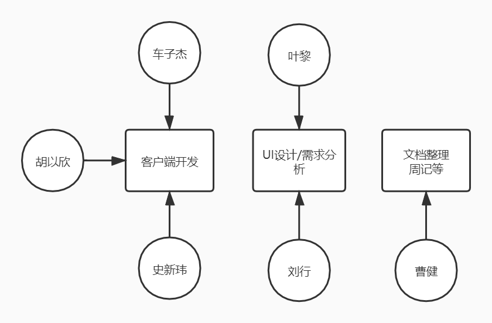

# 项目管理计划

- [项目管理计划](#项目管理计划)
  - [1. 简介](#1-简介)
    - [1.1 项目概述](#11-项目概述)
    - [1.2 项目交付产品](#12-项目交付产品)
    - [1.3 SPMP的演化](#13-spmp的演化)
  - [2. 项目组织](#2-项目组织)
    - [2.1 组织结构](#21-组织结构)
    - [2.2 项目职责](#22-项目职责)
  - [3. 管理过程](#3-管理过程)
    - [3.1 管理目标和优先级](#31-管理目标和优先级)
      - [基本管理原则](#基本管理原则)
      - [目标1：](#目标1)
      - [目标2：](#目标2)
      - [目标3：](#目标3)
      - [目标4：](#目标4)
      - [目标5：](#目标5)
    - [3.2 风险管理](#32-风险管理)
    - [3.3 监督和控制机制](#33-监督和控制机制)
      - [报告机制](#报告机制)
      - [报告格式](#报告格式)
      - [评价和审核机制](#评价和审核机制)
    - [3.4 人员计划](#34-人员计划)
  - [4. 技术过程](#4-技术过程)
    - [4.1 方法、工具和技术](#41-方法工具和技术)
    - [4.2 软件文档](#42-软件文档)
  - [5. 进度规划](#5-进度规划)
    - [5.1 进度规划](#51-进度规划)

## 1. 简介

### 1.1 项目概述

本项目为北京化工大学软件工程计科1703班课程设计“博物馆应用平台系统”的子系统——博物馆信息服务子系统。项目的目标是开发一款支持用户浏览博物馆信息及相关新闻并对数据进行分析显示的手机应用程序，同时组员们获得系统的软件工程项目训练。发布的产品是安卓的app，源代码，技术文档和用户手册等。主要工作是需求分析、系统设计、开发测试，关键里程碑分别为需求规格说明书的发布，系统设计说明书的发布，和系统的交付。项目所需资源为版本控制服务器和个人开发工具，进度大约为11周。

### 1.2 项目交付产品

项目交付日期为第14周，交付地点待定

主要交付物有：

安卓端安装程序(apk文件)、系统源代码、用户使用手册、技术文档包（包括需求规格说明书、系统设计说明书、系统测试说明书、项目总结文档等）、项目进度日志包（至少每周一份）。

### 1.3 SPMP的演化

SPMP在第七周周末前经由组间讨论、小组讨论形成初稿，由组长撰写并上传至配置文档库，由组长负责维护。

第八周以后根据项目的进展可以对其进行修改，并由组长讲修改稿上传至文档库。

## 2. 项目组织

### 2.1 组织结构

### 2.2 项目职责

角色|职责描述|负责人员|
:--:|:--:|:--:
项目经理|领导项目团队，执行和管理计划，负责项目的交付工作|胡以欣
需求分析员|整理需求分析并撰写需求分析文档|叶黎、刘行
UI工程师|根据需求分析做出界面设计；将设计图进行代码实现（待定）|叶黎、刘行
客户端开发|按UI设计搭建客户端项目，编写代码，生成客户端程序；自测保证程序可用；和组内外服务端约定接口格式|车子杰、史新玮、胡以欣
文档整理|整理文档|曹健
测试人员|进行软件测试|全体组员

## 3. 管理过程

### 3.1 管理目标和优先级

#### 基本管理原则

每位成员既是积极的建言者，又是负责的合作者。

决策应在充分的讨论基础上做出，并被及时有效的执行。

#### 目标1

按时按量完成项目的基本功能，按时发布产品

优先级：1(最高)

#### 目标2

遵循规范化的项目运作标准，文档严谨完整，代码注释充分，便于后续维护

优先级：2

#### 目标3

产品运行稳定，界面友好易上手，可用性强

优先级：3

#### 目标4

注重团队建设，成员分工合理，合作默契，气氛融洽

优先级：4

#### 目标5

项目设计和开发上有创新，营造出卖点

优先级：5

### 3.2 风险管理

风险#|标题|详细描述|发生可能性|影响|优先级|规避或减轻策略
:--:|:--:|:--:|:--:|:--:|:--:|:--:
1|需求风险|软件项目初期确定的需求可不确定，随着项目的进展，需求还可能不断变化|50%|严重的|中|需求制定充分预见未来；多与老师助教交流|设计方案留有变更的余地
2|技术风险|开发技术不熟练，没有组员曾有开发app的经验，部分组员未使用过git工具和Java编程语言。可能导致开发进程受阻，代码交流困难。|90%|灾难的|高|提前制定好学习计划；降低设计难度
3|组员时间安排风险|组员课业繁重同时需要准备考研，可能出现应对不暇、无法正常跟进项目进度情况|70%|严重的|高|组员合理安排自己的时间，提高效率。

### 3.3 监督和控制机制

#### 报告机制

- 各开发过程中、培训负责人以周为单位记录工作进展，形成电子文档报告，上传至文档库。
- 负责人在每周项目例会做口头总结，小组会议审核通过给出意见，报告修改后上传至文档库

#### 报告格式

- 暂定包括：报告主题，时间，负责人，报告内容，审核意见

#### 评价和审核机制

- 每周例会上小组讨论形成一致意见后即为通过，相关负责人针对改进意见开展下一周工作，小组会议持续评估其成效。
- 每一项目阶段结束之前（里程碑前后），组织一次阶段评审会，评估整个阶段的工作效率和成果 质量。尽量与项目例会合并。

## 4. 技术过程

### 4.1 方法、工具和技术

- 采用面向对象的分析设计方法；利用UML进行系统建模；统一文件命名、代码版式、注释等编码规范；通过GitHub实现项目管理；编码人员进行代码走查后再进行代码编译；测试人员根据测试文档进行单元测试；最后实现软件的交付。

- 开发环境
  - Java + Android Studio

### 4.2 软件文档

项目文档列举如下：

- 软件项目管理计划文档
  - 该文档由组长完成，介绍项目的整个管理过程。
  - 该文档在需求分析阶段开始完成，在后续每个阶段更新。
- 需求规格说明文档
  - 在需求分析阶段，由产品经理分析收集用户需求，其他组员进行补充，由组长负责编写规格说明文档，在后续的设计和开发阶段不断更新。
  - 该文档主要内容为：功能需求，性能要求，数据处理要求，软件运行需求等。
- 软件设计文档
  - 在总体设计阶段，小组根据需求规格说明文档，完成软件体系结构的设计，编写体系结构设计文档，并在后续开发阶段补充和更新。
  - 该文档由开发人员负责编写。
- 软件测试文档
  - 在软件开发阶段，测试人员需要编写测试规格说明文档，并在后续测试阶段更新。
  - 开发人员将根据测试规格说明文档建立测试环境。
- 用户文档
  - 在需求分析阶段，产品经理需要开始着手编写用户手册，并在需求分析结束后需要形成初稿；在后续阶段不断更新用户文档；并在系统交付阶段随着系统一起被交付。
- 项目周记
  - 贯穿软件开发始终，记录会议内容，项目进度，问题及解决方法等。
  - 由文档整理的负责人员编写

## 5. 进度规划

### 5.1 进度规划

时间|UI设计及需求分析|客户端|
:--:|:--:|:--:
第七周|进行初步UI设计和需求分析，学习生成布局图代码|环境配置，运行简单项目
第八周|完成需求规格说明和UI设计初稿|开始撰写设计报告，根据需求分析开始编码开发
第九周||完成设计报告初稿，进行编码开发
第十周||编码开发
第十一周||完成基本功能开发
第十二周||完成所有功能开发
第十三周|软件测试|软件测试
