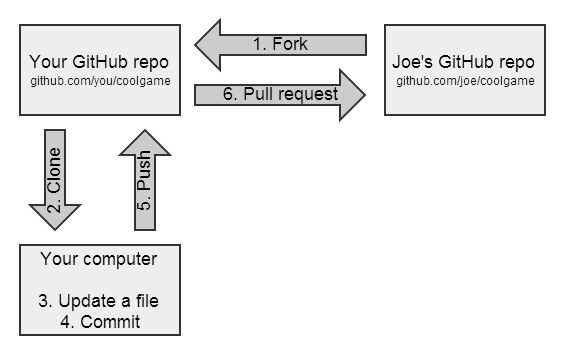

# git--版本控制

## I. 在pc上进行基础git配置

1. 注册GitHub账号

2. 下载git

     在 Windows 上安装 Git 也有几种安装方法。 官方版本可以在 Git 官方网站下载。 打开 https://git-scm.com/download/win，下载会自动开始。 要注意这是一个名为 Git for Windows 的项目（也叫做 msysGit），和 Git 是分别独立的项目；更多信息请访问 http://msysgit.github.io/

3. 进行基本配置

     安装完 Git 之后，要做的第一件事就是设置你的用户名和邮件地址。 这一点很重要，因为每一个 Git 提交都会使用这些信息，它们会写入到你的每一次提交中，不可更改：

     ```git
     git config --global user.name "John Doe"
     git config --global user.email johndoe@example.com
     ```
     
     再次强调，如果使用了 --global 选项，那么该命令只需要运行一次，因为之后无论你在该系统上做任何事情， Git 都会使用那些信息。 当你想针对特定项目使用不同的用户名称与邮件地址时，可以在那个项目目录下运行没有 --global 选项的命令来配置。

     如果想要检查你的配置，可以使用 git config --list 命令来列出所有 Git 当时能找到的配置。

     ```git
     git config --list

     //以下为输出
     user.name=John Doe
     user.email=johndoe@example.com
     color.status=auto
     color.branch=auto
     color.interactive=auto
     color.diff=auto
     ```

4. 配置ssh（可选）

## II. 基本操作

### 一、 在已存在目录中初始化仓库

如果你有一个尚未进行版本控制的项目目录，想要用 Git 来控制它，那么首先需要进入该项目目录中。 
之后执行：

- 建立本地仓库，让git管理跟踪

    ```git
    git init
    ```

- 在github建立仓库后，与github建立远程连接

    ```git
    git remote add origin xxxx.git（复制的那一串）
    ```

### 二、克隆现有的仓库

如果你想获得一份已经存在了的 Git 仓库的拷贝，比如说，你想为某个开源项目贡献自己的一份力，这时就要用到 git clone 命令。

克隆仓库的命令是 git clone <url> 。 比如，要克隆 Git 的链接库 libgit2，可以用下面的命令：

```git
git clone https://github.com/libgit2/libgit2
```

这会在当前目录下创建一个名为 “libgit2” 的目录，并在这个目录下初始化一个 .git 文件夹， 从远程仓库拉取下所有数据放入 .git 文件夹，然后从中读取最新版本的文件的拷贝。 如果你进入到这个新建的 libgit2 文件夹，你会发现所有的项目文件已经在里面了，准备就绪等待后续的开发和使用。

### 三、对仓库进行修改

1. 提交三剑客

    ```git
    git add .     // 把文件放在暂存区，git add 某文件名（只放某一个文件），git add . （所有文件）
    ```

    ```git
    git commit -m "给本次修改起一个名字"	// 生成一个新节点，记录相对于前一个结点的变化
    ```

    ```git
    git push
    ```

    - 中间要时不时的git status查看状态，查看是否符合预期，红色的是没在暂存区里的

2. 从远程仓库中抓取与拉取
     - 就如刚才所见，从远程仓库中获得数据，可以执行：

          ```git
          git fetch <remote>
          ```
          这个命令会访问远程仓库，从中拉取所有你还没有的数据。 执行完成后，你将会拥有那个远程仓库中所有分支的引用，可以随时合并或查看。

     - 如果你的当前分支设置了跟踪远程分支（阅读下一节和 Git 分支 了解更多信息）， 那么可以用 git pull 命令来自动抓取后合并该远程分支到当前分支。 这或许是个更加简单舒服的工作流程。默认情况下，git clone 命令会自动设置本地 master 分支跟踪克隆的远程仓库的 master 分支（或其它名字的默认分支）。 运行 git pull 通常会从最初克隆的服务器上抓取数据并自动尝试合并到当前所在的分支。

3. 推送到远程仓库
     当你想分享你的项目时，必须将其推送到上游。 这个命令很简单：
     ```git
     git push <remote> <branch>
     ```
     
     当你想要将 master 分支推送到 origin 服务器时（再次说明，克隆时通常会自动帮你设置好那两个名字）， 那么运行这个命令就可以将你所做的备份到服务器：

     ```git
     git push origin master
     ```

### 四、分支

- 新建的 Git 仓库默认只有一个分支 master
- 新建分支

     ```git
     git branch 新分支名
     ```

- 切换分支

     ```git
     git checkout 想切的分支
     ```

- 新建并切换分支

     ```git
     git checkout -b 新分支名
     ```

- 查看分支对应的远程分支（git push会push到哪个分支上，git pull 会从哪个分支pull）

     ```git
     git checkout -vv
     ```

- 查看所有分支

     ```git
     git branch -a
     ```

### 五、Fork操作
1. 派生项目

     如果你想要参与某个项目，但是并没有推送权限，这时可以对这个项目进行“派生（Fork）”。 当你“派生”一个项目时，GitHub 会在你的空间中创建一个完全属于你的项目副本，且你对其具有推送权限。

     通过这种方式，项目的管理者不再需要忙着把用户添加到贡献者列表并给予他们推送权限。 人们可以派生这个项目，将修改推送到派生出的项目副本中，并通过创建拉取请求（Pull Request，简称 PR）来让他们的改动进入源版本库，下文我们会详细说明。 创建了拉取请求后，就会开启一个可供审查代码的板块，项目的拥有者和贡献者可以在此讨论相关修改，直到项目拥有者对其感到满意，并且认为这些修改可以被合并到版本库。

     


2. GitHub工作流

     GitHub 设计了一个以拉取请求为中心的特殊合作流程。 它基于我们在 主题分支 的 Git 分支 中提到的工作流程。 不管你是在一个紧密的团队中使用单独的版本库，或者使用许多的“Fork”来为一个由陌生人组成的国际企业或网络做出贡献，这种合作流程都能应付。

     流程通常如下：

     - 派生一个项目

     - 从 master 分支创建一个新分支

     - 提交一些修改来改进项目

     - 将这个分支推送到 GitHub 上

     - 创建一个拉取请求

     - 讨论，根据实际情况继续修改

     - 项目的拥有者合并或关闭你的拉取请求

     - 将更新后的 master 分支同步到你的派生中     

3. 解决fork的和原来仓库不一样的问题

    ```git
    git remote add upstream 原仓库.git
    git fetch upstream
    git merge upstream/你想要的分支    // 注意本次merge是merge到本地个人分支；
    git push
    ```

4. 组员怎么做？

   - Note: 参考链接
   https://git-scm.com/book/zh/v2/GitHub-%E5%AF%B9%E9%A1%B9%E7%9B%AE%E5%81%9A%E5%87%BA%E8%B4%A1%E7%8C%AE

   1. fork项目仓库
      - fork得比较早的同学的版本可能和仓库已经不一样了，参考6解决一下
   2. 将小组对应分支clone到本地

        ```git
        git clone -b 分支名 fork下来的仓库.git
        ```

        比如：git clone -b group3 git@github.com:SokachH/testForHYX.git
   3. 对文件内容改动后，参考4提交三剑客

        ```git
        git add .
        git commit
        git push
        ```

        然后点pull request

5. 解决远程仓库比本地仓库领先的问题

    ```git
    git pull origin
    git merge origin master
    git push origin
    ```

6. 注意：尽量不要强制push，否则会覆盖别人的commit
    - 比如发现你的push有问题，尽量不要git -f push
